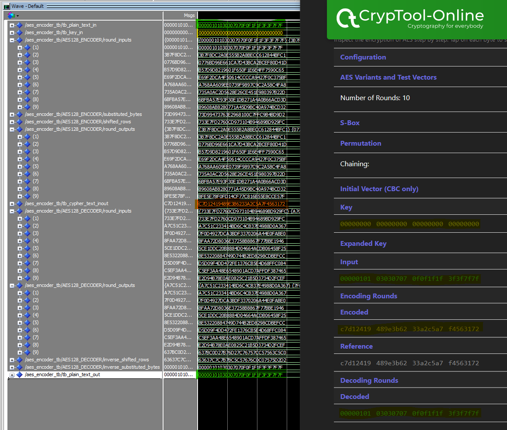
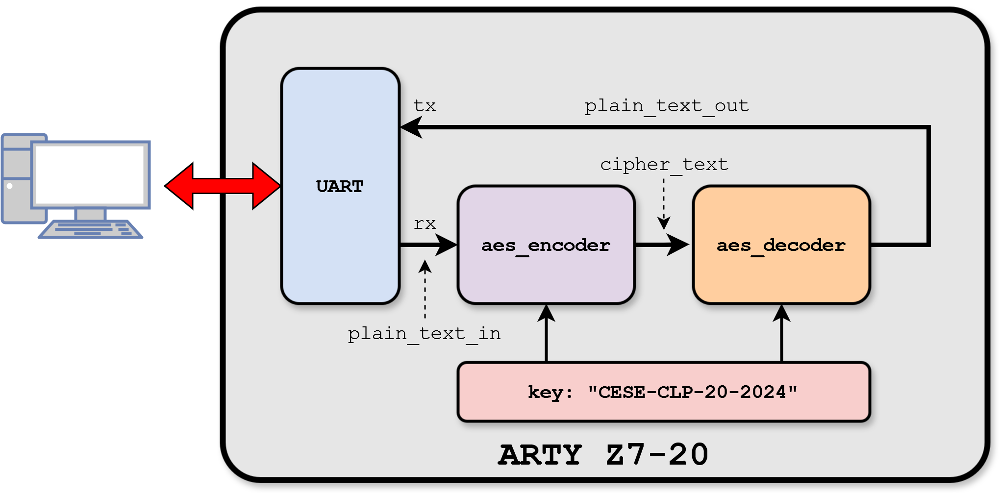

# Trabajo Práctico Final - Módulo Encriptador AES-128

  

* **Autor:** Ing. Leandro Soria
* **Asignatura:** Circuitos Lógicos Programables.
* **Plataforma:** `Arty Z7-20`

## Objetivos
* Desarrollar componentes que describan de manera combinacional el algoritmo de encriptación y desencriptación AES-128.
* Realizar un *test bench* que permita simular el comportamiento de los mismos utilizando ModelSim.
* Sintetizar la implementación realizada para la plataforma `Arty Z7-20` usando Vivado.

## Estructura del Repositorio
* `img`: Imágenes usadas en este archivo README.
* `sim`: Archivos de simulación (no agregados, debería crearse un proyecto de ModelSim en este directorio).
* `src/rtl`: Componentes del proyecto desarrollados.
* `src/tb`: Test benches para probar los componentes desarrollados.
* `synth`: Archivos de síntesis (no agregados, debería crearse un proyecto de Vivado en este directorio).

## Notas del autor
* El core del proyecto son los componentes `aes_encoder.vhd` y `aes_decoder.vhd`. Ellos son quienes deberían instanciarse en el proyecto que desee agregar esta funcionalidad. En la siguiente figura se muestra una captura de pantalla de la simulación de un encoder conectado en serie con el decoder:

* El archivo top de este proyecto es `tp_final_top.vhd`, el cual implementa un mecanismo de loopback a través de una UART, de acuerdo al siguiente diagrama de bloques:

## Links de Referencia
* [AES Step by Step - CrypTool.org ](https://www.cryptool.org/en/cto/aes-step-by-step)
* [Arty Ze-20 Resource Center](https://digilent.com/reference/programmable-logic/arty-z7/start?redirect=1)
* [digilent-xdc: XDC Files](https://github.com/Digilent/digilent-xdc/)
* [VHDL UART by pabennett](https://github.com/pabennett/uart)
